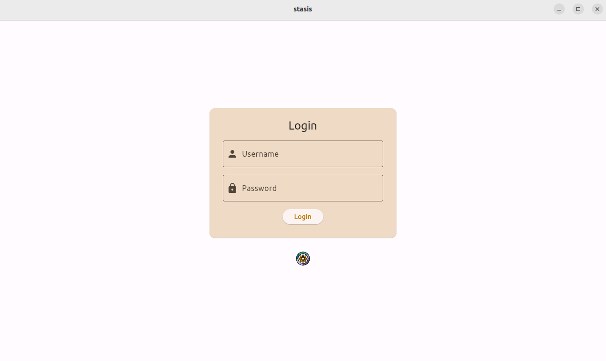
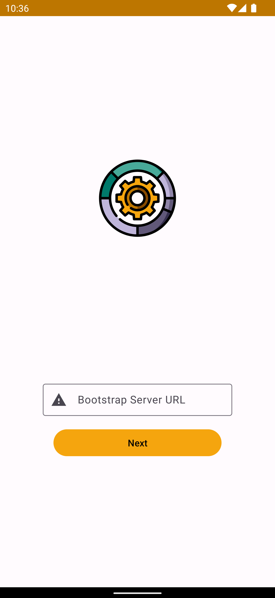

# stasis

> A **[stasis](https://en.wikipedia.org/wiki/Stasis_(fiction))** */ˈsteɪsɪs/* or **stasis field**, in science fiction,
> is a confined area of space in which time has been stopped or the contents have been rendered motionless.

`stasis` is a backup and recovery system with an emphasis on security and privacy; no personal information is collected,
no unencrypted data leaves a client device and all encryption keys are fully in the control of their owner.

### Linux/macOS Client CLI
[](https://asciinema.org/a/YMIf9oCMfvrbznnMnCrUMfar9?speed=3)

### Linux/macOS Client UI
|               |      |
|-----------------------------------------------------------------------------|-------------------------------------------------------------------|
|  |  |

### Android Client
|  |  |            |
|--------------------------------------------------------------------------|---------------------------------------------------------------------|----------------------------------------------------------------------------------|
|          |  |  |

## Why?

* **Trust Issues** - Do you trust your backup or infrastructure/storage provider with your unencrypted data?
* **Multi-Device** - How many backup providers would you need to cover all types of devices you own?
* **Self-Hosted** - What if your backup provider goes out of business?

## Goals

* Recover user data from total failure or device loss
* Replicate data to local and remote/cloud storage
* Encrypt data before it leaves a device
* Manage all device backups from a single service

*Along with [`provision`](https://github.com/sndnv/provision), the goal is to be able to grab a blank/off-the-shelf
device and recover the original system in an automated and repeatable way.*

## Features

* ***[Client-only Encryption](https://github.com/sndnv/stasis/wiki/Architecture-%3A%3A-Encryption)*** -
  encryption and decryption is done by client applications; the server never deals with unencrypted data or metadata
* ***[Device-only Secrets](https://github.com/sndnv/stasis/wiki/Architecture-%3A%3A-Secrets)*** -
  user credentials and device secrets do not leave the device on which they were entered/generated
* ***[Default Redundancy](https://github.com/sndnv/stasis/wiki/Architecture-%3A%3A-Core-Persistence)*** -
  copies of a device's encrypted data are sent to multiple nodes by default (local and remote)
* ***[Hybrid Data Storage](https://github.com/sndnv/stasis/wiki/Architecture-%3A%3A-Data-Stores)*** -
  various storage backends (**[Slick](https://scala-slick.org/)**, **in-memory**, **file-based**) are supported and used
* ***Secrets Escrow*** -
  enables storing encrypted device secrets on the server to simplify recovering of a lost or replaced device
* ***Serverless Mode*** -
  (*TODO*) enables creating backups and recovering from them without the presence of a server

## Installation

### Server
Docker images for `server`, `server-ui`, `identity` and `identity-ui` can be found under [Packages](https://github.com/sndnv?tab=packages&repo_name=stasis).

> See [deployment/production](deployment/production/README.md) for more information on how to set up and deploy the services.

### Clients
Client binaries for Linux, macOS and Android can be found for each [release](https://github.com/sndnv/stasis/releases).

#### Linux and macOS
The provided installer can be used:
```
$ curl -s "https://raw.githubusercontent.com/sndnv/stasis/master/deployment/production/scripts/client_install.sh" | bash
```

###### Removing
The Linux and macOS clients can be uninstalled using:
```
$ curl -s "https://raw.githubusercontent.com/sndnv/stasis/master/deployment/production/scripts/client_uninstall.sh" | bash
```

###### Updating
The Linux and macOS clients can be updated by uninstalling the current version and installing the latest one:

```
$ curl -s "https://raw.githubusercontent.com/sndnv/stasis/master/deployment/production/scripts/client_uninstall.sh" | bash
$ curl -s "https://raw.githubusercontent.com/sndnv/stasis/master/deployment/production/scripts/client_install.sh" | bash
```

> Secrets, configuration, logs and operation state are NOT removed when uninstalling the client!

#### Android
On Android, installing and updating is done by simply downloading the `apk` file and running it.

### Testing
Images and binaries for testing/development purposes can be created locally using the existing [dev tools](deployment/dev).

## Development
Refer to the [DEVELOPMENT.md](DEVELOPMENT.md) file for more details.

## Contributing

Contributions are always welcome!

Refer to the [CONTRIBUTING.md](CONTRIBUTING.md) file for more details.

## Versioning

We use [SemVer](http://semver.org/) for versioning.

## License

This project is licensed under the Apache License, Version 2.0 - see the [LICENSE](LICENSE) file for details

> Copyright 2018 https://github.com/sndnv
>
> Licensed under the Apache License, Version 2.0 (the "License");
> you may not use this file except in compliance with the License.
> You may obtain a copy of the License at
>
> http://www.apache.org/licenses/LICENSE-2.0
>
> Unless required by applicable law or agreed to in writing, software
> distributed under the License is distributed on an "AS IS" BASIS,
> WITHOUT WARRANTIES OR CONDITIONS OF ANY KIND, either express or implied.
> See the License for the specific language governing permissions and
> limitations under the License.
